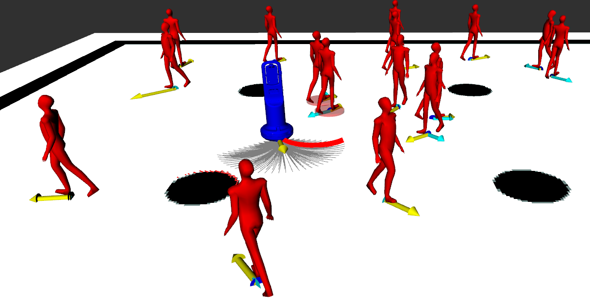
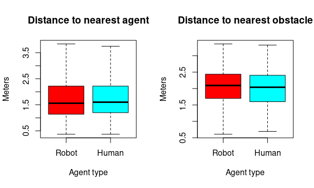
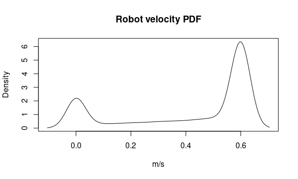
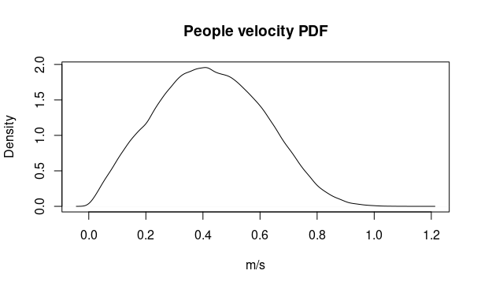

# ENPS_DWA simulator
A C++ ROS simulator for reactive social robot navigation based on Enzymatic Numerical P systems.
It is based on the model proposed in [1] by Ignacio Perez-Hurtado, David Orellana-Martin, Miguel A. Martinez-del-Amor and Luis. Valencia-Cabrera.

## Abstract

A mobile robot acting in a human environment should follow social conventions such as keeping security distances and navigating at speeds that do not disturb the surrounding people while avoiding obstacles in real-time. The problem is more complex if a differential-drive wheeled robot is considered, whose trajectories are constrained by nonholonomic and kinematics restrictions. It is an NP-hard problem  widely studied in the literature, by combining disciplines such as Psychology, Mathematics, Computer Science and Engineering. In this work, we propose a novel solution based on the paradigm of Membrane Computing, the Social Force Model and the Dynamic Window Approach Algorithm. The result is a model which is able to compute the best motion command for the robot in logarithmic time, considering the surrounding people, obstacles, as well as the current state of the robot. The model is compatible with other membrane computing models for robotics and suitable for an implementation on parallel hardware. Finally, a visual simulator has been implemented in ROS and C++ for validation and testing purposes.

## Software description

The software simulates a number of human agents in an in-door environment walking under a social random walk, i.e., each agent selects a random near goal and walk to approach it by following the Social Force Model, when the goal is reached, another goal is randomly selected. There is a simulated dual-wheeled non-holonomic robot navigating by using the ENPS model described in [1], the robot goals are selected in the same way as the human goals. The robot parameters are based on [2], the people parameters are based on [3,4,5]. The ENPS model computes for each time-instant the optimal velocity vector of the robot by following the SFM and then a variant of the Dynamic Window Approach is applied to select an appropiated motion command. The simulation is executed until the user kills the process. A file *metrics.txt* is generated with information for each agent about velocities and distances to nearest obstacle and nearest agent. The purpose of this software is to validate the ENPS model and provide a proof of concepts. An efficient parallel implementation is proposed as future work.

The software shows in the RVIZ GUI a visualization in real-time of the simulation (see video below), showing the force vectors for each agent, the simulated Lidar scan, the simulated people detections, the set of possible robot motion commands (circular trajectories) and the selected motion command.

## Compilation instructions

The software has been developed for ROS Noetic under Ubuntu 20.04.

1. Install ROS Noetic in Ubuntu 20.04 (desktop-full-install) following the instructions at http://wiki.ros.org/noetic/Installation/Ubuntu
2. Create an empty workspace following the instructions at http://wiki.ros.org/catkin/Tutorials/create_a_workspace
3. Clone this repository in the */src* folder of the workspace.
4. Compile the whole workspace by using **catkin_make**

## Running instructions
There is an example *launch* file at *enps_dwa/launch/* folder.

**roslaunch enps_dwa temple.launch**

## Analysis

The software includes a folder called *metrics* with the raw *metrics.txt* file for a simulation of 160 minutes. A script in R is included in such a folder to generate graphics the graphics below about distances and velocities. The robot velocity is limited to 0.6 m/s as in [2], the people velocity has a maximum of 1.2 m/s. As can be seen in the first graphics. The behaviour of the robot is similar to the people with respect to distances to people and obstacles despite the non-holonomic constraints. 

## Acknowledgements

This work was supported by the research project TIN2017-89842-P (MABICAP), co-financed by *Ministerio de Economia, Industria y Competitividad (MINECO)* of Spain, through the *Agencia Estatal de Investigacion (AEI)*, and by *Fondo Europeo de Desarrollo Regional (FEDER)* of the European Union.

This software uses and adapts the LightSFM library [6] for the Social Force Model and the PedLab pedestrian simulator [7] developed by the Service Robotics Lab (Pablo de Olavide University) under the terms of the BSD license in the framework of the TERESA FP7 project [2]. The authors acknowledge the Service Robotics Lab (Pablo de Olavide University) for such a great software.

## References

**[1]** I. Perez-Hurtado, D. Orellana-Martin, M.A. Martinez-del-Amor, L. Valencia-Cabrera. (2021). *A membrane computing framework for social navigation in robotics*. To be published.

**[2]**  K. Shiarlis, J. Messias, M. van Someren, S. Whiteson, J. Kim, J. Vroon, G. Englebienne, K. Truong, V. Evers, N. Perez-Higueras, I. Perez-Hurtado, et al. *Teresa: A socially intelligent semi-autonomous telepresence system*. In Workshop on MAchine Learning for Social Robotics, IEEE International Conference on Robotics and Automation (ICRA), 2015., Seattle, U.S. 

**[3]** Helbing, Dirk & Molnar, Peter. (1998). *Social Force Model for Pedestrian Dynamics*. Physical Review E. 51. 10.1103/PhysRevE.51.4282. 

**[4]** Moussaid M, Helbing D, Garnier S, Johansson A, Combe M, et al. (2009) *Experimental study of the behavioural mechanisms underlying self-organization in human crowds*. Proceedings of the Royal Society B: Biological Sciences 276: 2755–2762.

**[5]** Moussaid, Mehdi & Perozo, Niriaska & Garnier, Simon & Helbing, Dirk & Theraulaz, Guy. (2010). *The Walking Behaviour of Pedestrian Social Groups and Its Impact on Crowd Dynamics*. PloS one. 5. e10047. 10.1371/journal.pone.0010047. 

**[6]** https://github.com/robotics-upo/lightsfm/

**[7]** https://github.com/robotics-upo/pedlab

